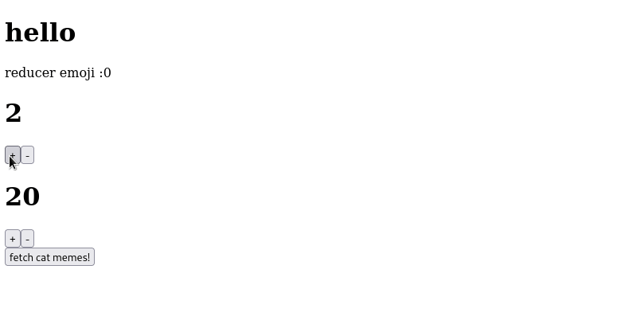

<h1 align="center">GXI</h1>

<p align="center">
    <i>Cross-Platform Native Widget based Component System in Rust</i>
</p>

<p align="center">
    <a href="https://github.com/gxi-rs/gxi/actions">
        
    </a>
    <a href="https://github.com/gxi-rs/gxi/actions">
        
    </a>
</p>

> ⚠️ Early Stage

Using [proc-macros](https://doc.rust-lang.org/reference/procedural-macros.html),
the [gxi transpiler](gxi-transpiler/README.md) transpile a component tree into a
stateful self-managed n-binary tree using observable sync/async state pattern,
for maximum efficiency and lowest possible overhead, with close to no runtime
cost. Inherently, eliminating the use of a
[virtual dom](https://reactjs.org/docs/faq-internals.html) or a
[diffing algorithm](https://reactjs.org/docs/reconciliation.html). The component
system is platform-agnostic, which allows the system to produce
platform-dependent and independent components, merging them for code reuse and
maintainability.

## Platforms

- [x] Web `wasm32-unknown-unknown`
- [ ] Desktop (GTK) Windows, Mac and Linux
- [ ] Platform Independent (Web and GTK)
- [ ] Android
- [ ] Ios

## Examples

```rust
use gxi::{gxi, set_state, State, StrongNodeType, Text};

pub fn cat_fact() -> StrongNodeType {
    let cat_fact = State::new(String::new());

    let fetch_cat_fact = set_state!(
        async || {
            let resp = reqwest::get("https://catfact.ninja/fact?max_length=140")
                .await
                .unwrap();
            *(*cat_fact).borrow_mut() = resp.text().await.unwrap();
        },
        [cat_fact]
    );

    // pre fetch cat memes
    fetch_cat_fact();

    return gxi! {
        div [
            button ( on_click = move |_| fetch_cat_fact() ) [
                Text ( value = "fetch cat memes!" )
            ],
            p [
                Text ( value = &cat_fact[..])
            ],
        ]
    };
}
```



Full src [here](examples)

## Code of conduct

Code of conduct can be found at **[CODE_OF_CONDUCT.md](CODE_OF_CONDUCT.md)**

## Contributing

Make sure to read **[Contribution Guidelines](CONTRIBUTING.md)** before
contributing.

## License & Copyright

Copyright (C) 2021 Aniket Prajapati

Licensed under the **[MIT LICENSE](LICENSE)**

## Contributors

- [Aniket Prajapati](https://aniketprajapati.me)
  <[contact@aniketprajapati.me](mailto:contact@aniketprajapati.me)>
